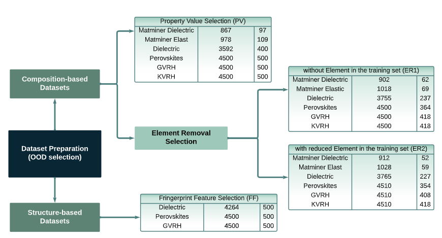

# PhysicalEncoding

Physical Encoding Improves OOD Performance in Deep Learning Materials Property Prediction

Nihang Fu, Sadman Sadeed Omee, Jianjun Hu* <br>
Machine Learning and Evolution Laboratory <br>
Department of Computer Science and Engineering <br>
University of South Carolina

## Table of Contents
- [Requirements](#Requirements)

- [Datasets](#Datasets)

- [Acknowledgement](#Acknowledgement)

## Requirements

Packages requirements
```
pip install pymatgen
pip install matminer
```  

## Datasets  
Datasets are from `MatBench` and `Matminer`. After processing, we can get datasets as shown below. There are composition- and structure-based datasets. For each, we use different OOD selection methods. The size of each dataset for PV, ER1, ER2, and FF selection methods are shown in the figure. The first column lists the dataset names; the second column indicates the number of materials used in the training process (the training and the ID test sets); the third column specifies the number of materials in the OOD sets.



## Acknowledgement
```
@article{dunn2020benchmarking,
  title={Benchmarking materials property prediction methods: the Matbench test set and Automatminer reference algorithm},
  author={Dunn, Alexander and Wang, Qi and Ganose, Alex and Dopp, Daniel and Jain, Anubhav},
  journal={npj Computational Materials},
  volume={6},
  number={1},
  pages={138},
  year={2020},
  publisher={Nature Publishing Group UK London}
}

@article{ward2018matminer,
  title={Matminer: An open source toolkit for materials data mining},
  author={Ward, Logan and Dunn, Alexander and Faghaninia, Alireza and Zimmermann, Nils ER and Bajaj, Saurabh and Wang, Qi and Montoya, Joseph and Chen, Jiming and Bystrom, Kyle and Dylla, Maxwell and others},
  journal={Computational Materials Science},
  volume={152},
  pages={60--69},
  year={2018},
  publisher={Elsevier}
}
```

## Cite our work
```


```

# Contact
If you have any problem, feel free to contact us via [nihang@email.sc.edu](mailto:nihang@email.sc.edu).
